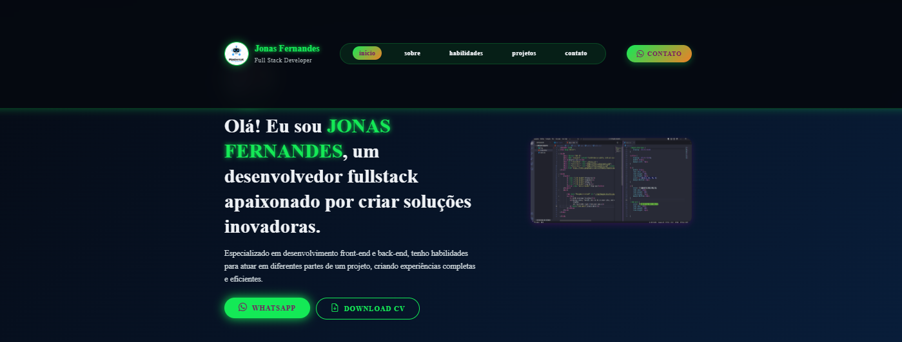
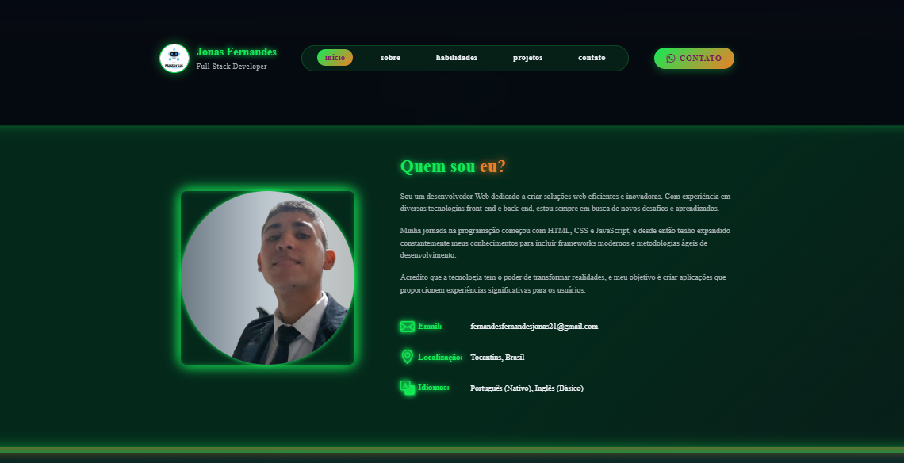
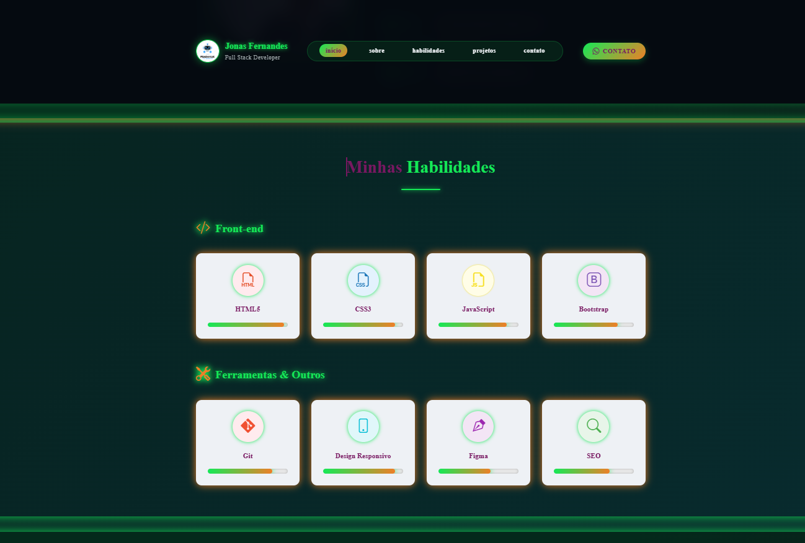
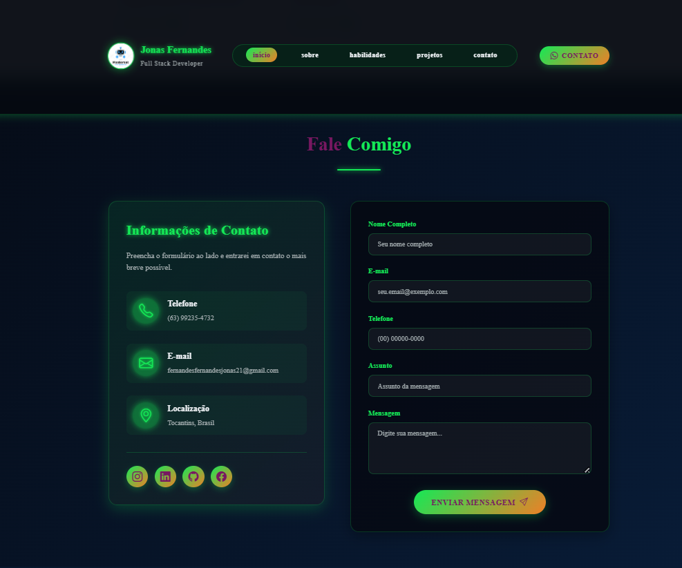
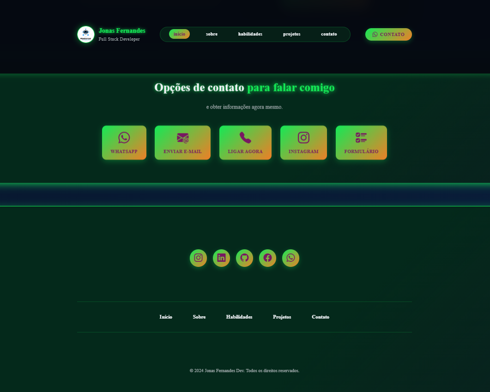

# Meu Portfólio Pessoal

Este é o meu site portfólio pessoal, desenvolvido para apresentar meus projetos, habilidades e formas de contato.

## Tecnologias usadas

- HTML5  
- CSS3  
- JavaScript  

## Como rodar o projeto localmente

1. Clone o repositório:  

2. Entre na pasta do projeto:

3. Abra o arquivo `index.html` no navegador (duplo clique ou arraste para o navegador)

## Imagens do projeto

## Autor

Jonas Fernandes Costa  
[LinkedIn](https://www.linkedin.com/)  
[GitHub](https://github.com/mastersatjonas)
